## manual

[offline 10 steps](./How_to_use_TRANSKRIBUS_-_10_steps.pdf)

## how to steps

|step|comment|
|---|---|
|   |
|   |mark regions manual   |
|   |untick `Find Text Regions`
|   |Run Layout Analysis
|   |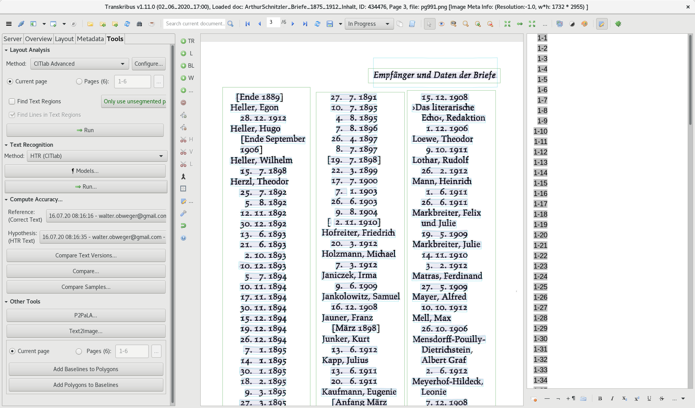
|   |after a short time, lines are found   |
|   |
|   |Run Text Recognition   |
|   |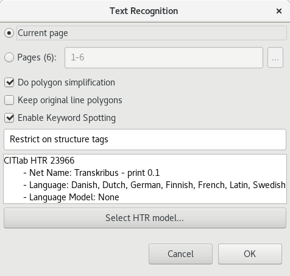
|   |choose HTR model, hier `Transkribus print`   |
|   |
|   |confirm again   |
|   |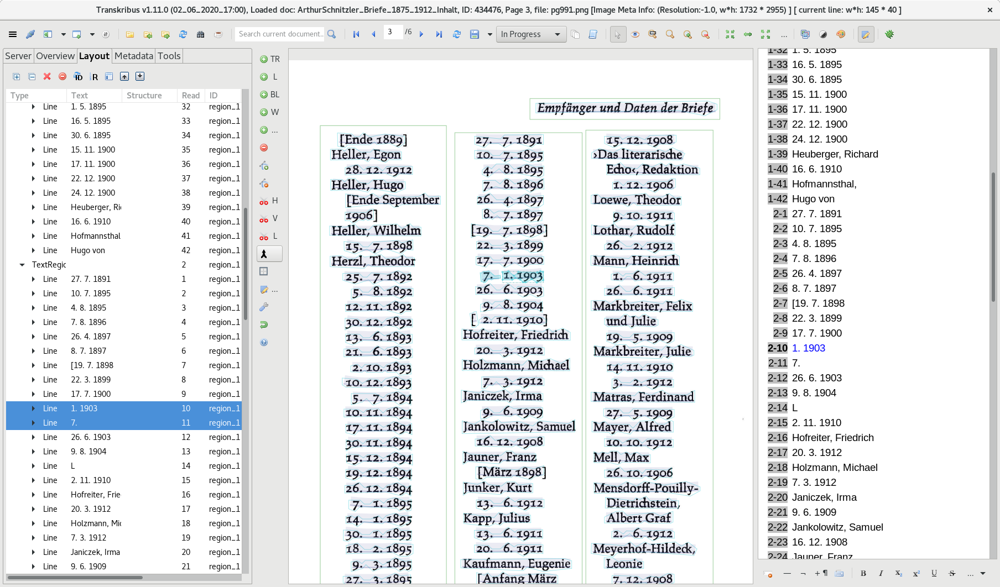
|   |check recognition   |
|   |some lines need to be edited
|   |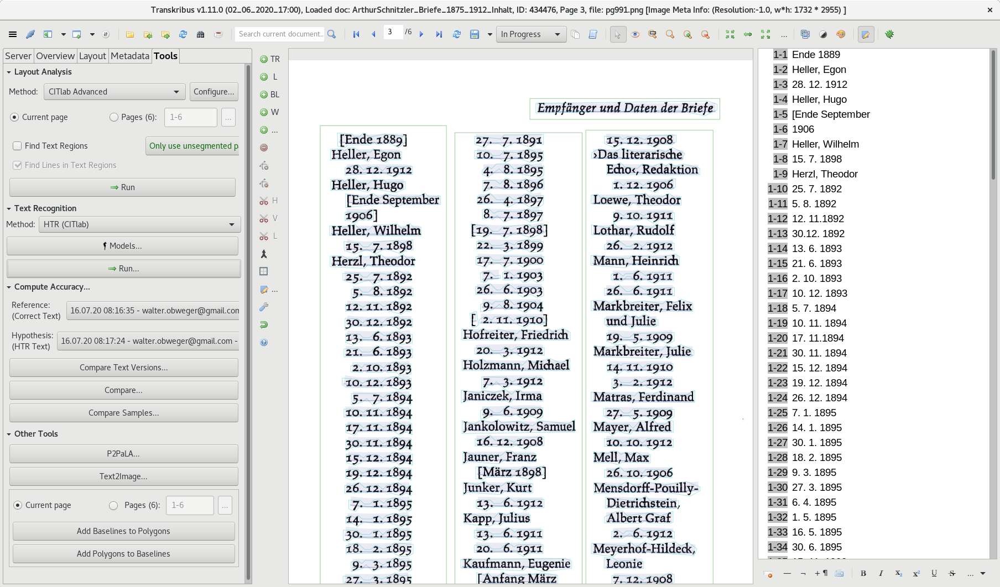
|   |   |
|   |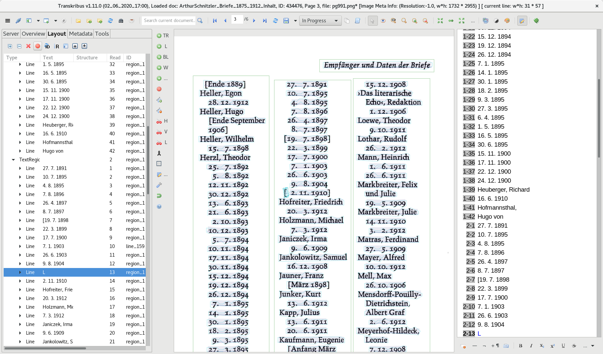
|   | delete uninteresting  |
|   | icon in toolbar on top or right
|   |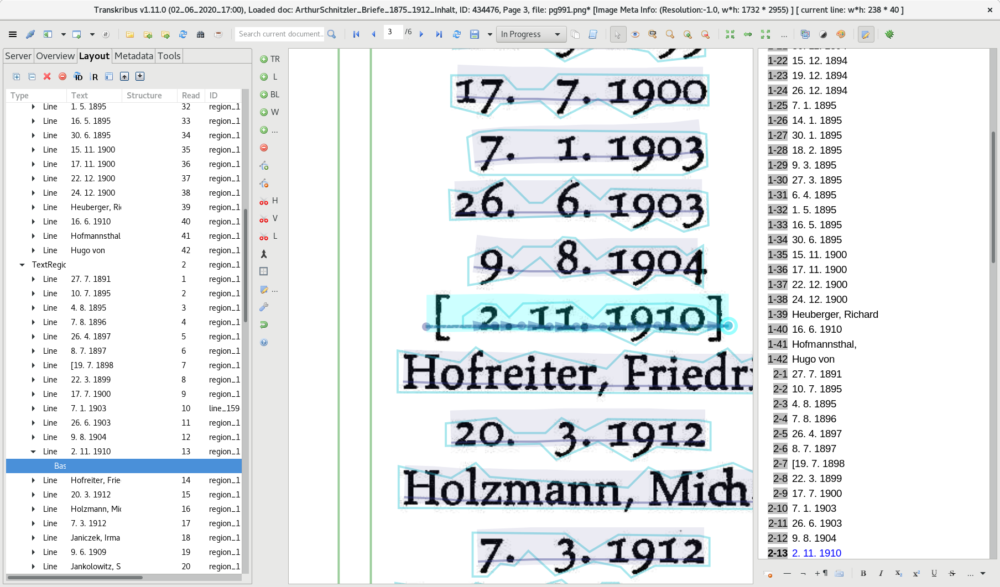
|   | edit line  |
|   |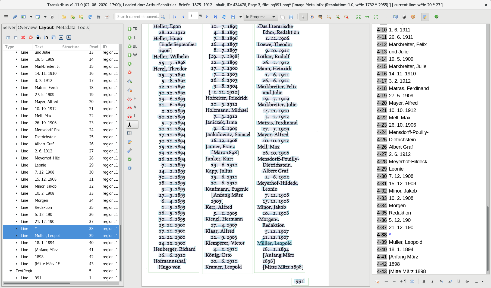
|   | merge regions  |
|   |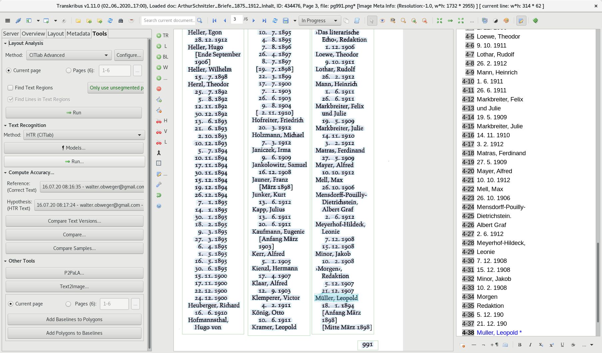
|   |rerun text recognition   |
|   |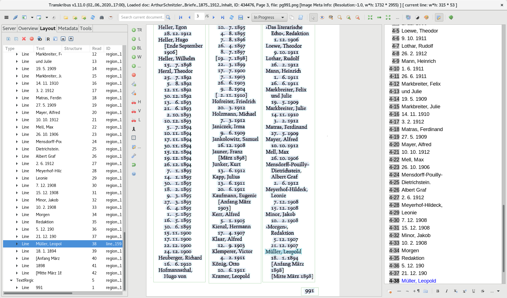
|   |now correct character shows   |
|   |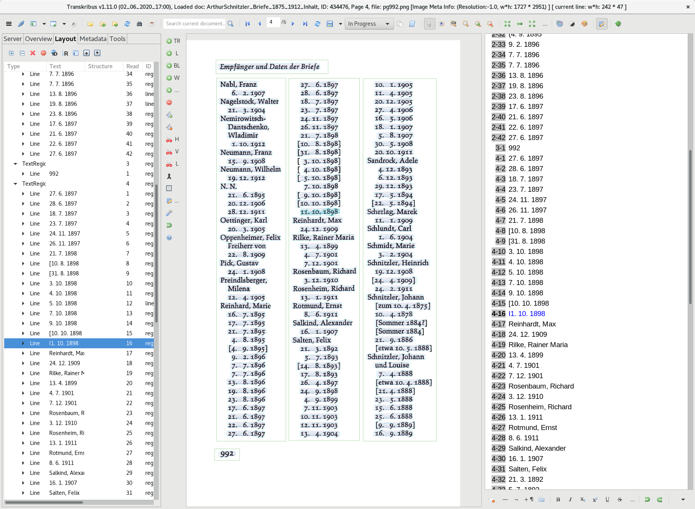
|   | edit text  |
|   |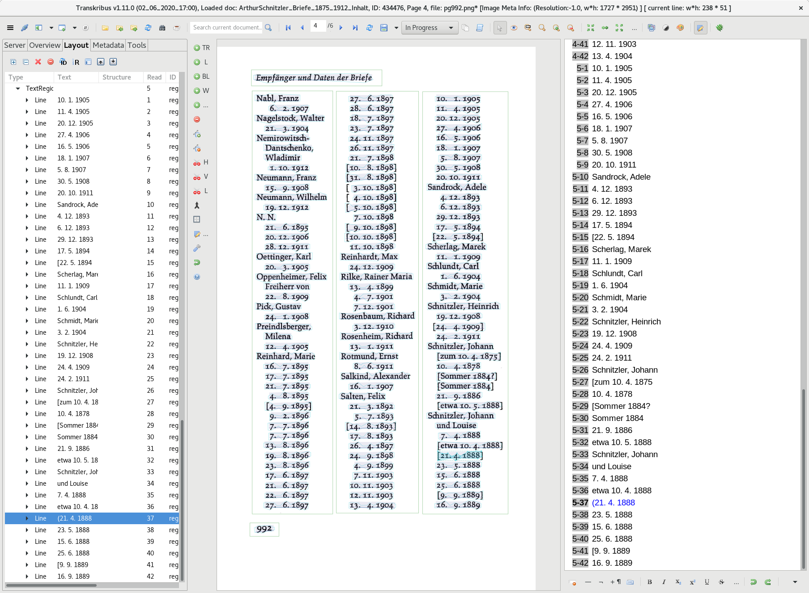
|   | edit text  |
|   |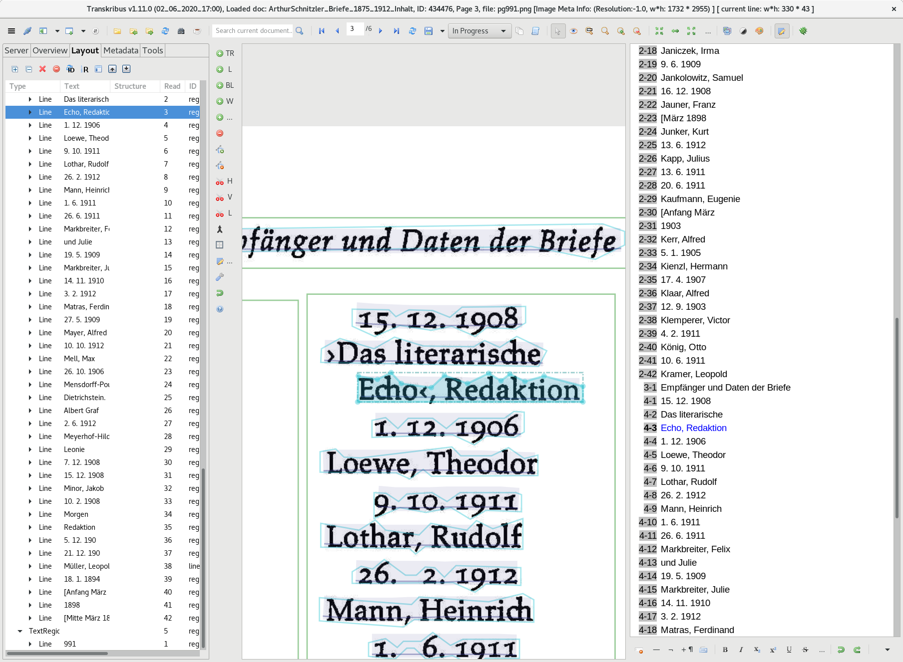
|   | how to deal with `>` `<` unclear  |
|   |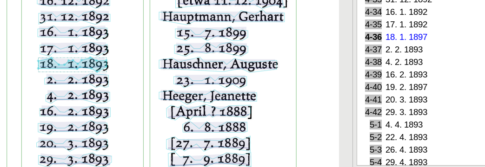
|   | look out for semantic errors too  |
|   |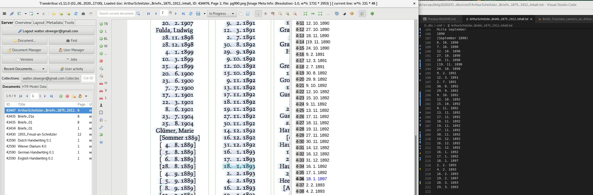
|   | simple text export might be easiest to use  |
