# Workflow Documentation

This document describe how to create a nice looking documentation
with little effort. I'm a visual focused coder and therefore interested in content, text and screenshots. After a couple of years
operating system change completely as they look and work, if at all.
Assuming you keep functioning system or even use virtual machines
a detailed documentation becomes very useful.
This reasoning has been supported by a dear customer of mine form the old days working in Switzerland, [BKW](https://www.bkw.ch/de/);
just to emphasize the relevance.

On the other hand, I don't like to spend time formatting fonts,headers and such, used to work with
[LaTex](https://www.latex-project.org/).
As time went by a new way became available which is based on [markdown](https://www.markdownguide.org/).
Markdown is integral part of many platforms, I would say of any relevant platform for the future ([github](https://github.com), [gitlab](https://gitlab.com), ...).
A very small set of format [instructions](https://www.markdownguide.org/basic-syntax) are available to do the job, fitting on a single
[cheat sheet](https://commonmark.org/help/).
On the other hand you may like to get a PDF, one way is by
means of [pandoc](https://pandoc.org/) a :sunglasses: and flexible
converter. Last but not least [vscode](https://code.visualstudio.com/) function as backbone. Calling vscode an powerful editor doesn't
do it justice; it's an infrastructure a worthy successor of
[emacs](http://www.gnu.org/software/emacs/).

```
Documentation is a love letter to your future self.
```


Google has integrated its Co-Laboratory into Google Drive.
An easy way to use Jupyter Notebook `validateDates.ipynb`
available at public sharing [wroACDHitp202003](https://drive.google.com/drive/folders/1qOIcFVc9RVIO3tkh3m2P_z7vdrsKHNTU).

|step   | comment |
|---    |---|
|       |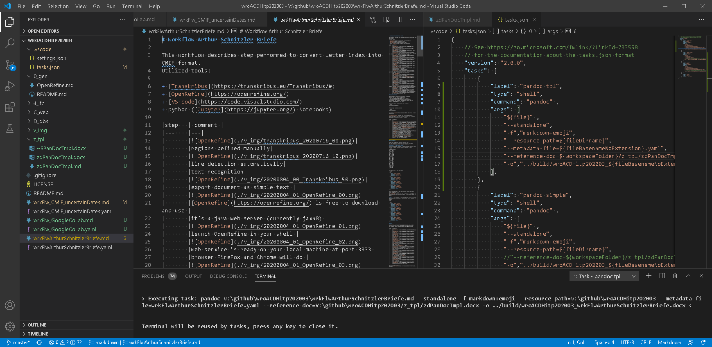|
|       |this is vscode|
|       |on the left, explorer view including git status indication|
|       |middle show markdown file edited, which we are going to convert into a pdf|
|       |right side show task configuration (json file), so your conversion task gets available in vscode menu|
|       |you can configure any command and pass arguments as required|
|       |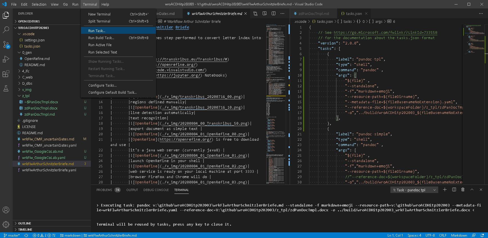|
|       |we want to launch `pandoc.tpl`|
|       |click menu `Terminal`->`Run Task...`->`pandoc tpl`|
|       |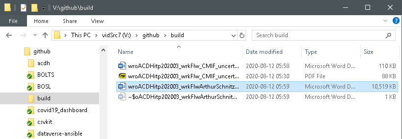|
|       |almost instantly word document show up in build folder|
|       |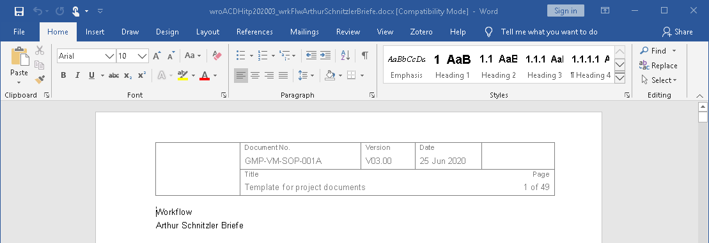|
|       |only a few finishing touches remain|
|       |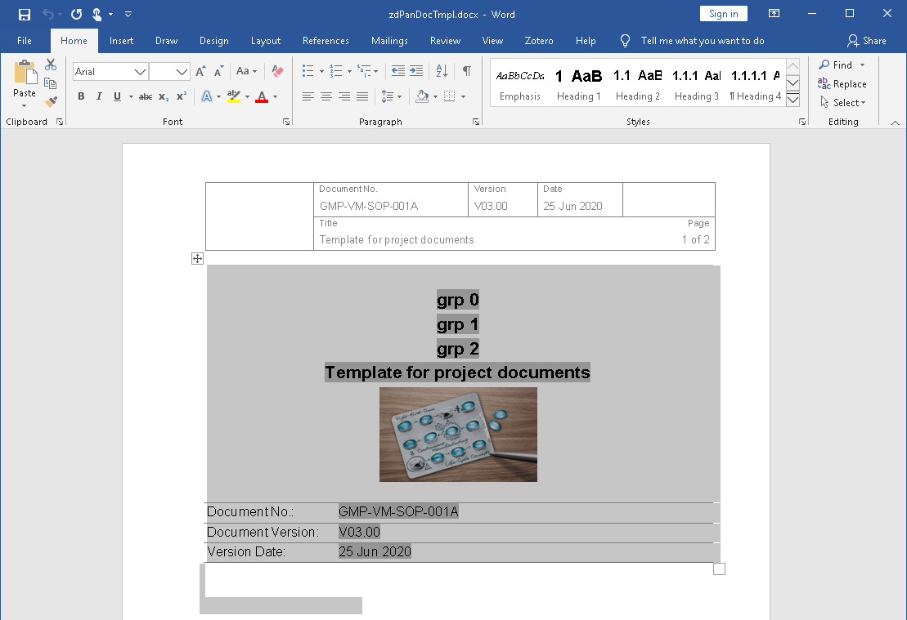|
|       |open template, that hold document title page|
|       |select and copy|
|       |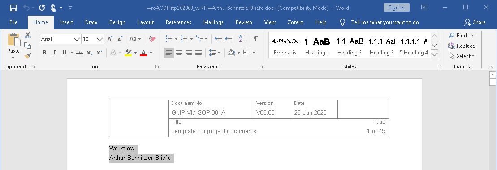|
|       |select placeholder put here on purpose|
|       |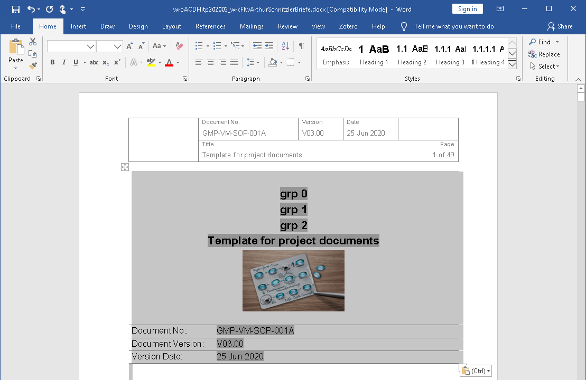|
|       |paste title page in|
|       |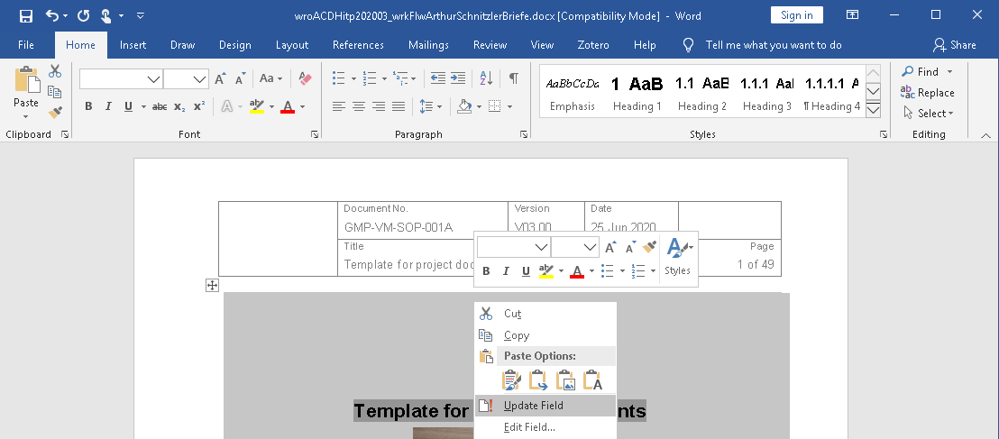|
|       |update field (pressing `F9` would work currently on Windows|
|       |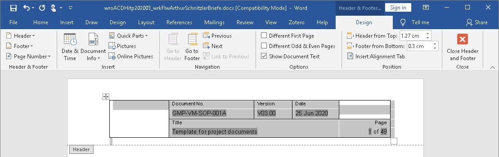|
|       |update header field too|
|       |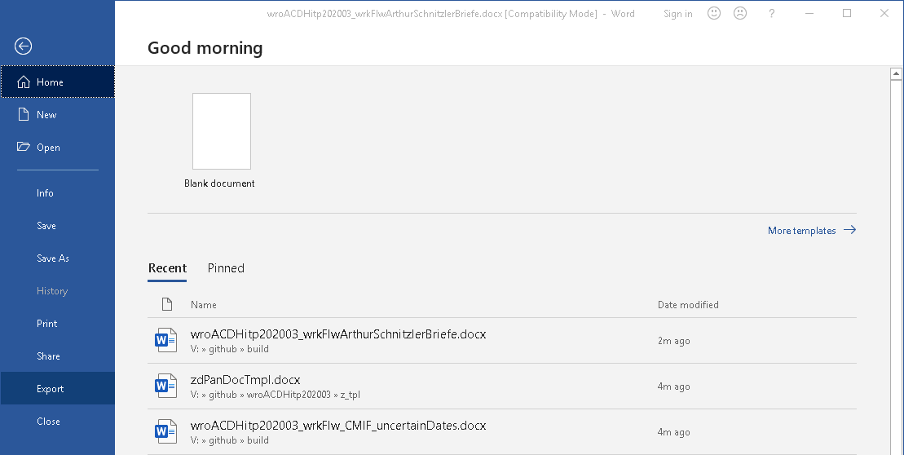|
|       |export document as pdf|
|       |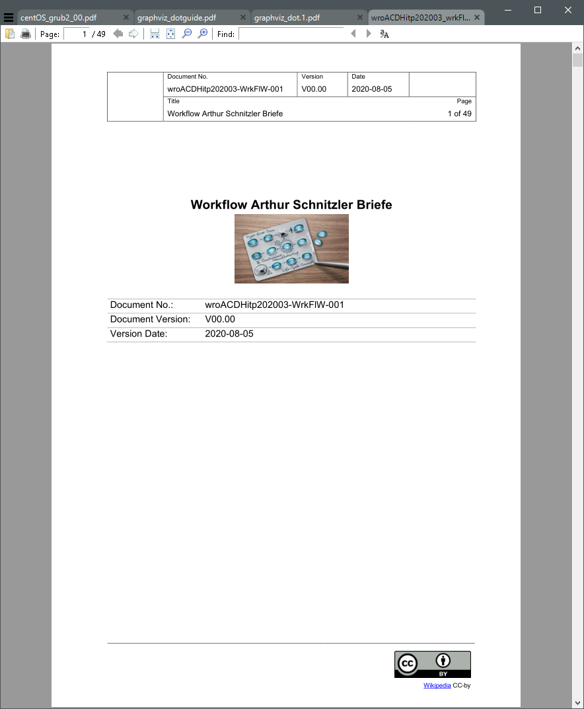|
|       |done, you can add any document properties via yaml file|
