# Workflow Google Colaboratory

Google has integrated its Co-Laboratory into Google Drive.
An easy way to use Jupyter Notebook `validateDates.ipynb`
available at public sharing [wroACDHitp202003](https://drive.google.com/drive/folders/1qOIcFVc9RVIO3tkh3m2P_z7vdrsKHNTU).

|step   | comment |
|---    |---|
|       |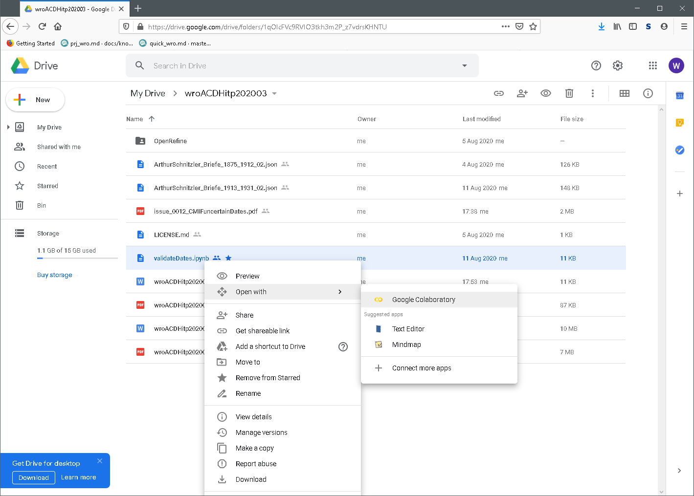|
|       |navigate to Google Drive public sharing|
|       |select jupyter notebook and open context menu|
|       |choose `Open with` -> `Google Colaboratory`
|       |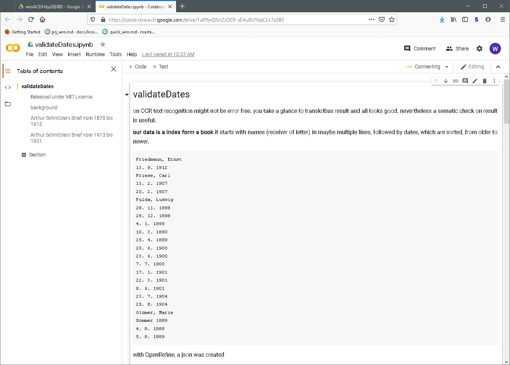|
|       |an enviorment spins up within a few seconds|
|       |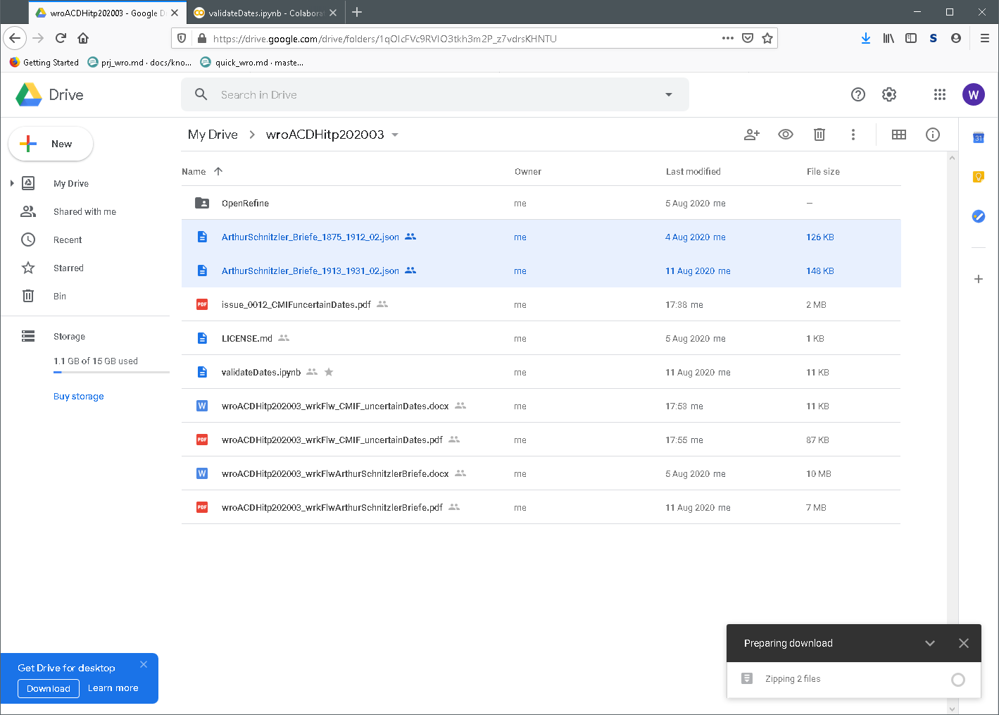|
|       |upload input files to CoLab or use Google Drive|
|       |I prefer slow way, download files locally|
|       |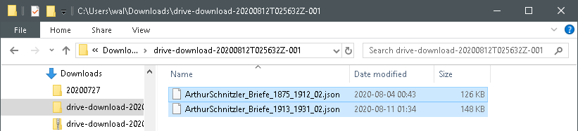|
|       |unzip, select and drag them into Colab file section|
|       |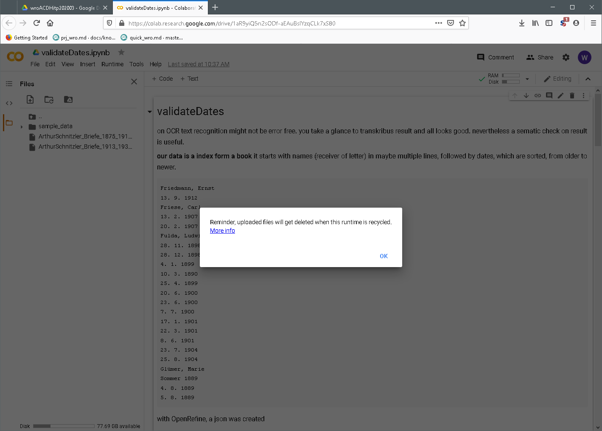|
|       |your environment is a temporary one, data are transient|
|       |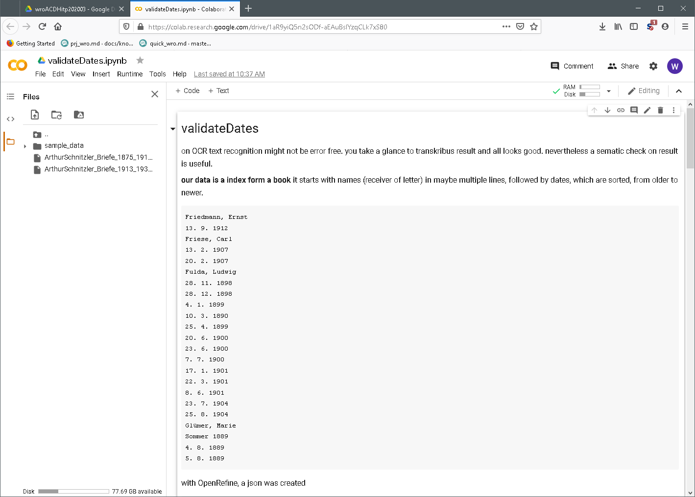|
|       |okay now you are set|
|       |go through notebook, walk your way down|
|       |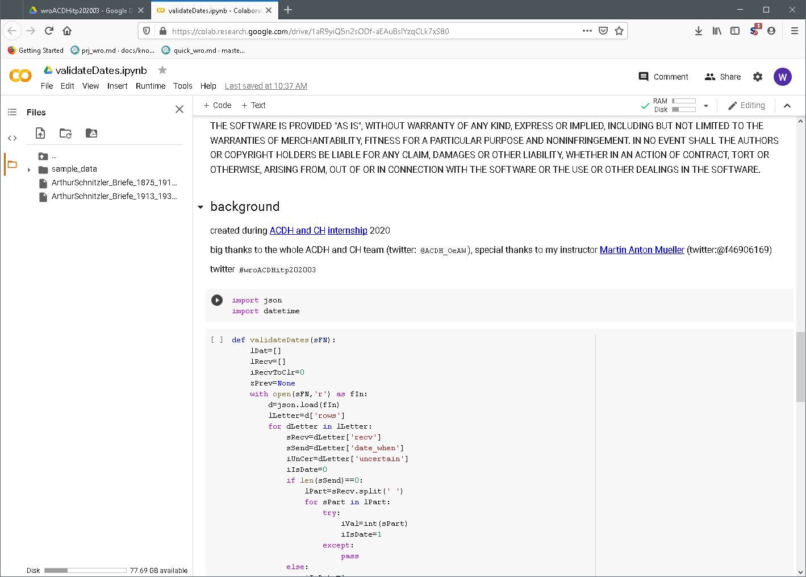|
|       |execute python scripts, push play button|
|       |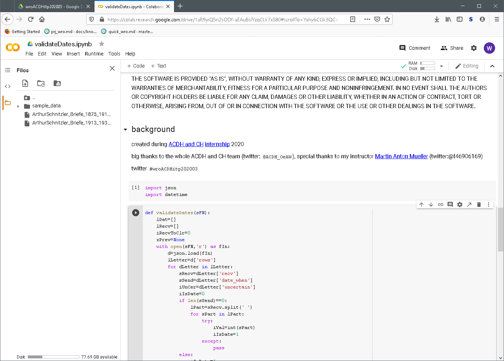|
|       |after script has been executed, a running number shows|
|       |you are allowed to jump back and execute code fragments in any order you see fit|
|       |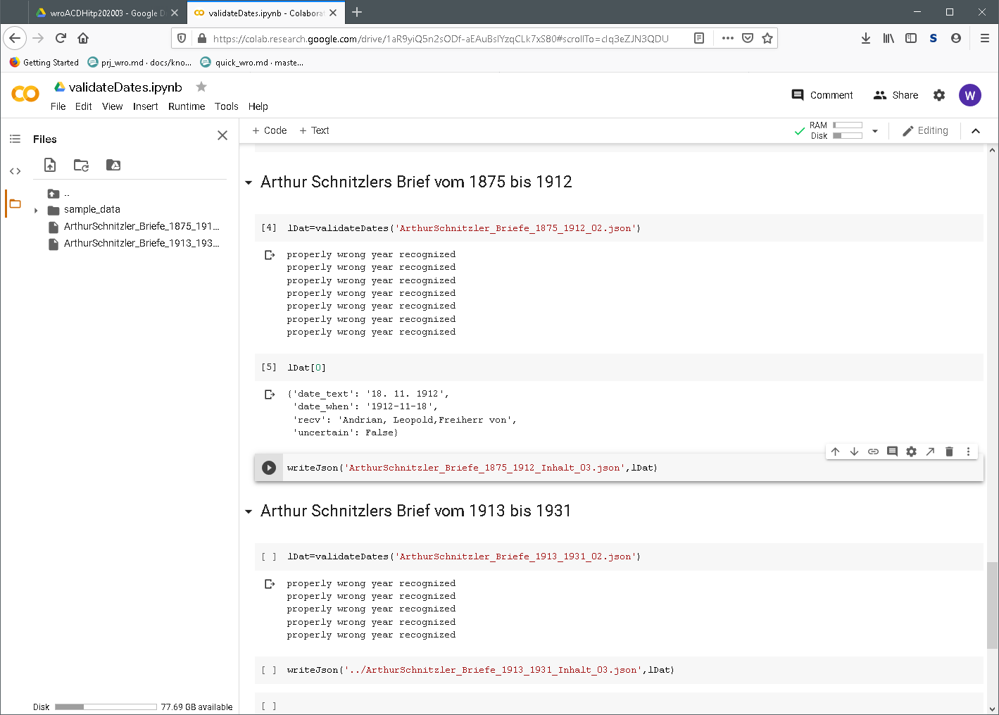|
|       |notice, console output (print and such) appear under code fragment|
|       |this output is stored in notebook a most liked feature by me|
|       |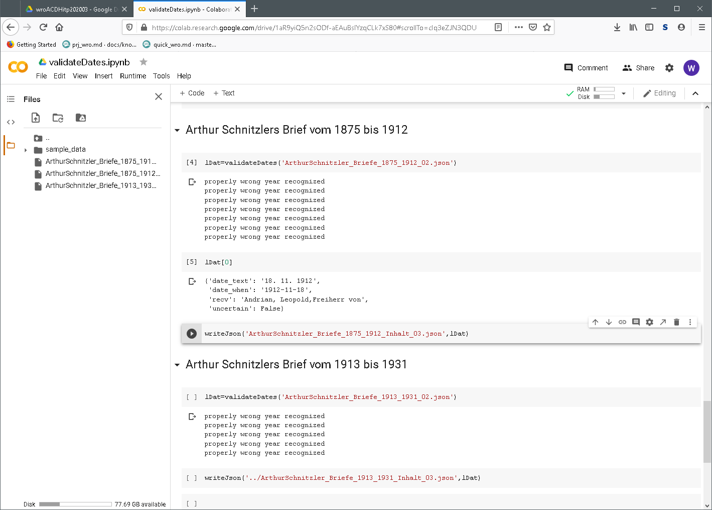|
|       |result is stored into json file available in files section again|
|       |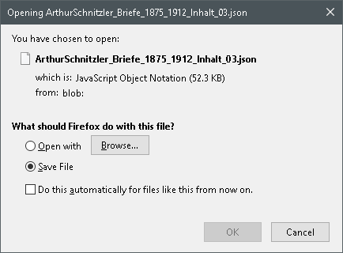|
|       |download transient file|
|       |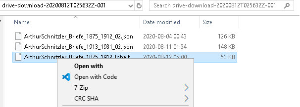|
|       |open with your editor of choice, mine is vscode here on Windows|
|       |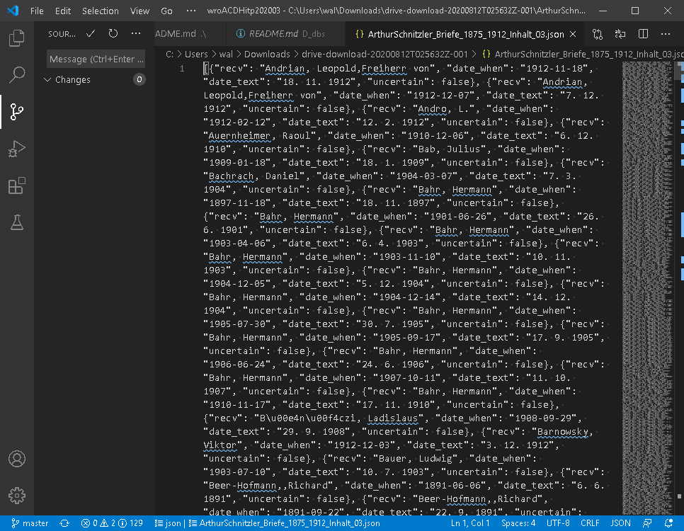|
|       |output is machine friendly|
|       |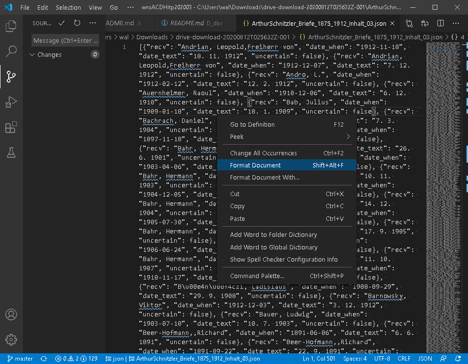|
|       |with extension Beautify it's easy to `Format Document` human friendly|
|       ||
|       |much better, isn't that cool|
|       |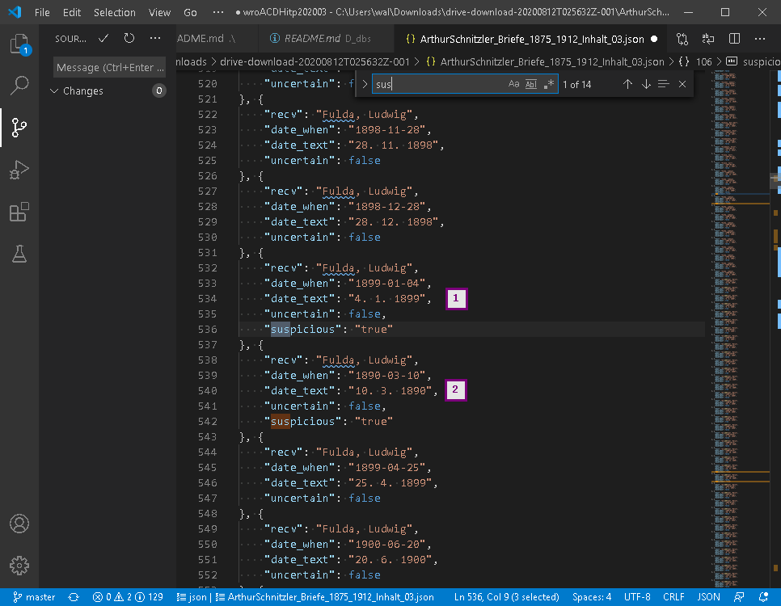|
|       |search for `suspicious`|
|       |notice dates are supposed to be chronological|
|       |clearly `2` is off, here caused by text recognition error|
|       |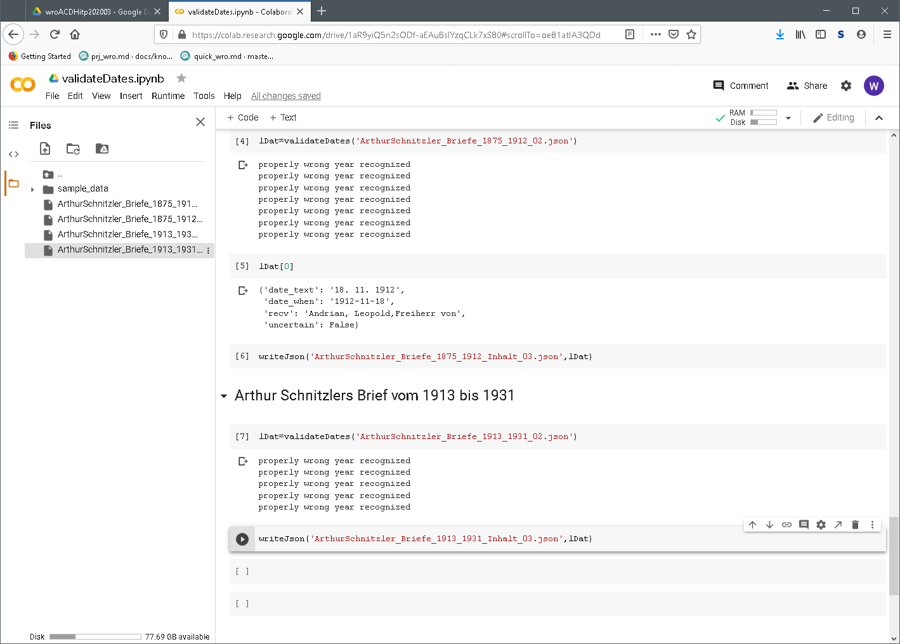|
|       |same for the second batch|
|       |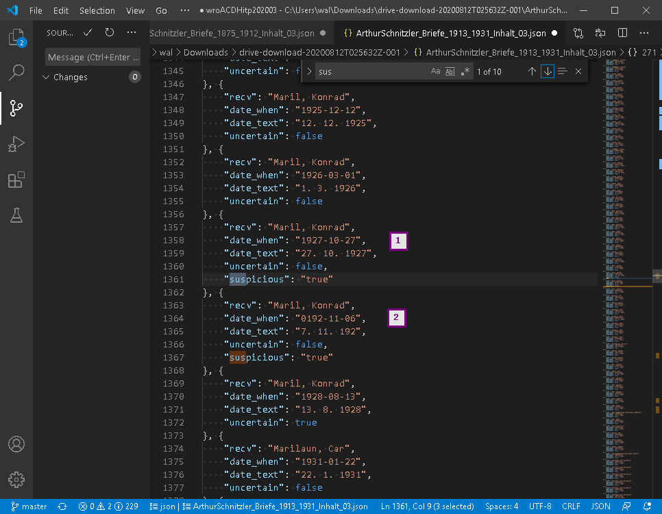|
|       |ui, date `2` is clearly incorrect|
