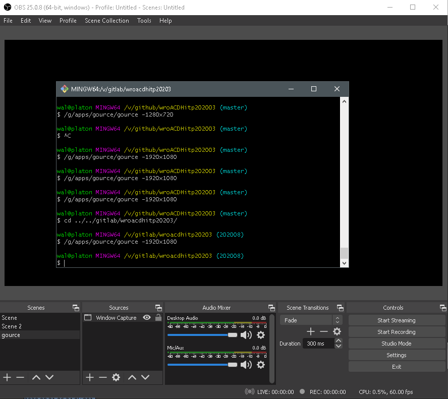
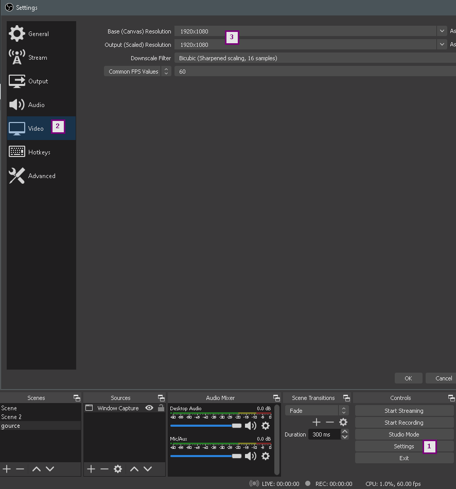
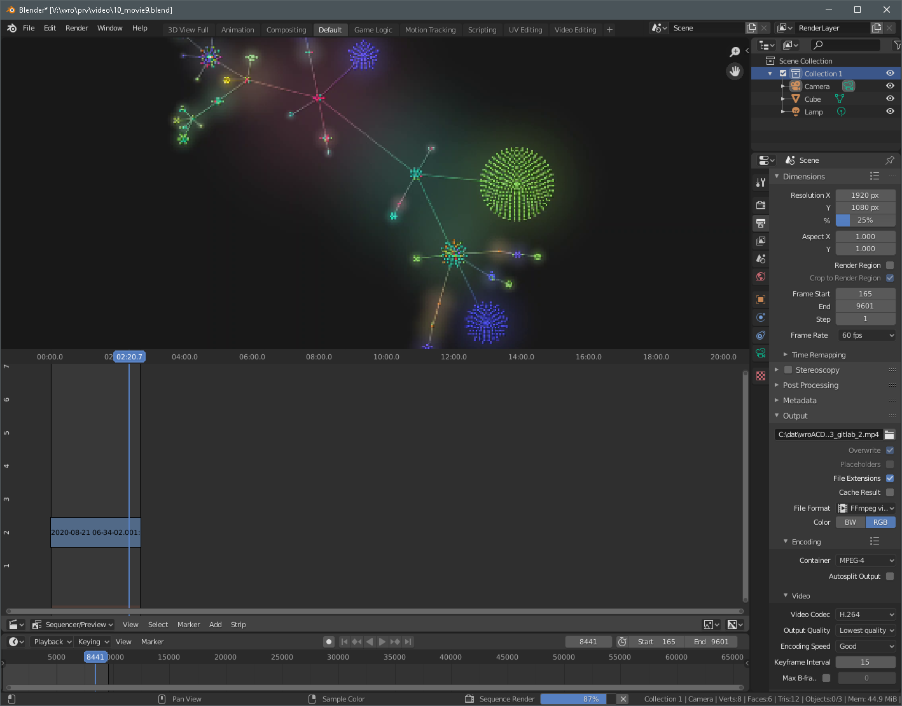
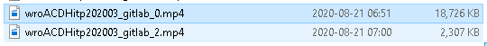
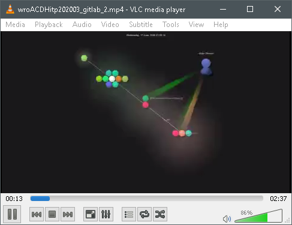

# Workflow repo viz

this workflow describes how to create a repository
visualization to be shared as move.
git repository log information is visualized.

tools you want:

+ [gource](https://gource.io/)
+ [OBS Studio](https://obsproject.com/)
+ [blender](https://www.blender.org/)
+ [vlc](https://www.videolan.org/vlc/)

|step   | comment |
|---    |---|
|       ||
|OBS    |
|       |adjust video `settings` to full HD|
|OBS    |define scene `gource`|
|       |launch `gource -1920x1080` in a git repo your choice|
|       |add source window capture and pick gource window|
|       |now you are set, start recoding and after that launch gource|
|       |stop recording at a time you like|
|blender||
|       |launch `blender` and add your movie in `Video Sequencer`|
|       ||
|       |pick start and end frames|
|       |choose video container and codec|
|       |best to share is mp4, `H.264`
|       |you may want to reduce size by reducing percentage
|       |choose output filename|
|       |start `Render Animation` and wait ...
|       ||
|       |after rendering finished check output|
|       |notice file size of 100 percent to 25 percent
|vlc    ||
|       |use a video play of your choice to watch|
